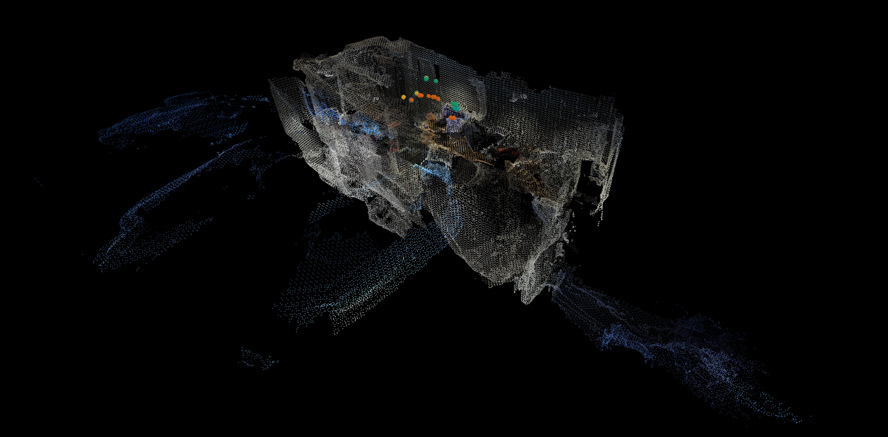

# Construction Safety Monitoring with Spatial Mapping



## Overview

Real-time construction site safety monitoring system combining 3D spatial mapping with AI-powered hazard detection.

## Key Features

- **3D Spatial Mapping** - ZED camera captures full site geometry in real-time
- **YOLO Hazard Detection** - Identifies PPE violations (no hardhat, no safety vest) 
- **VLM Analysis** - Vision-Language Model provides detailed safety violation summaries
- **Interactive Web Viewer** - Click hazard points to see AI analysis
- **Position Tracking** - Maps violations to exact 3D coordinates

## Quick Start

```bash
# 1. Capture site with hazard detection
cd vlm_fine_tuned/spatial_mapping
python spatial.py --build_mesh

# 2. View results in browser
python web_viewer.py mesh_gen.obj
```

Open http://127.0.0.1:5000 and click red hazard points to see VLM analysis.

## Requirements

- ZED Camera (ZED, ZED 2, ZED 2i, ZED X)
- NVIDIA GPU with CUDA support
- Python 3.10 or 3.11
- PyTorch with CUDA
- Transformers, PEFT (for VLM)
- Ultralytics (for YOLO)
